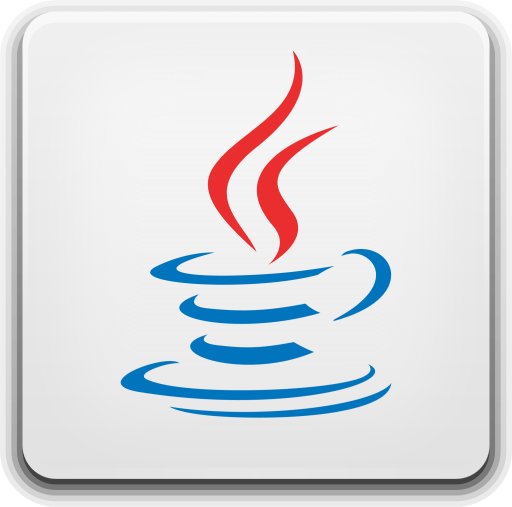

# 👋 Hello, GitHub!

Welcome to my awesome repository!  
Here I share my projects, ideas, and experiments in programming, data science, and server development.

---

## 🚀 About Me

I am an aspiring developer paving my way toward a dream.  
Areas I’m passionate about in IT:

- Java
- Data Science
- Server-side development
- Mathematics & Algorithms

---

## 🛠 Languages, OS, Tools & Frameworks

| Skill                                                | Description                   | Skill                                                | Description                   |
|------------------------------------------------------|--------------------------------|------------------------------------------------------|--------------------------------|
|                          | C / C++ / C#                   |                       | Java                          |
|                     | Python                         |                       | Rust                          |
|                    | Windows                        |                      | Linux                         |
|                       | Mathematics                    |                        | SQL                           |
|                     | Docker                         |                    | Backend & Infrastructure      |
|                     | Django (Python framework)      |                    | FastAPI (Python framework)    |
|                     | Rocket (Rust framework)        |                                                      |                                |

---

## 📬 Contact Me

If you have any questions or collaboration opportunities, feel free to reach out:

- **Email**: artemiy.sychev21@gmail.com  
- **LinkedIn**: [@Artemy Sychev](https://www.linkedin.com/in/artemy-sychev-803465207/)  
- **CodeWars**: [@Artemy Sychev](https://www.codewars.com/users/Artemy%20Sychev)  
- **LeetCode**: [@Artemy Sychev](https://leetcode.com/artemiy-228/)  

  

  

---

⭐ **If you like this repository, give it a star!**
